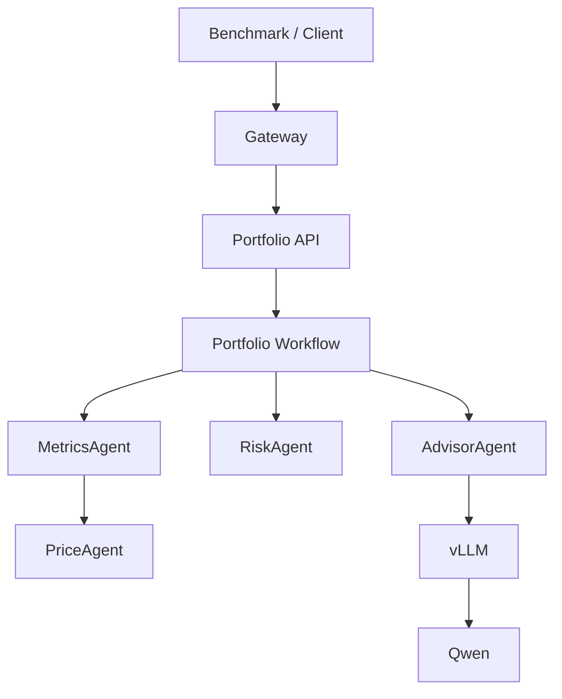
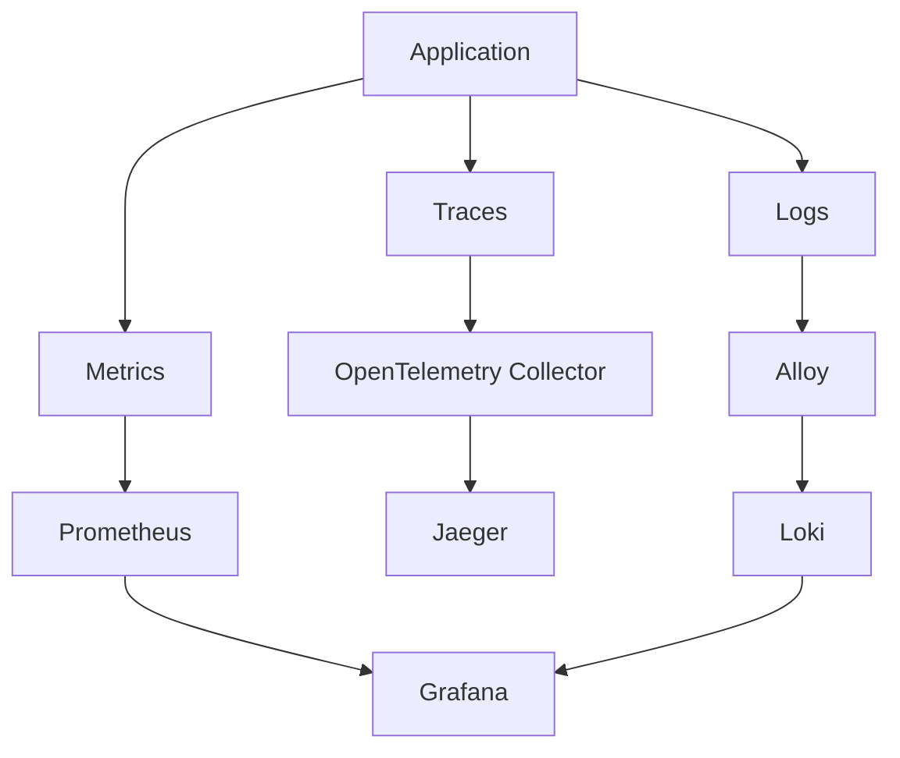
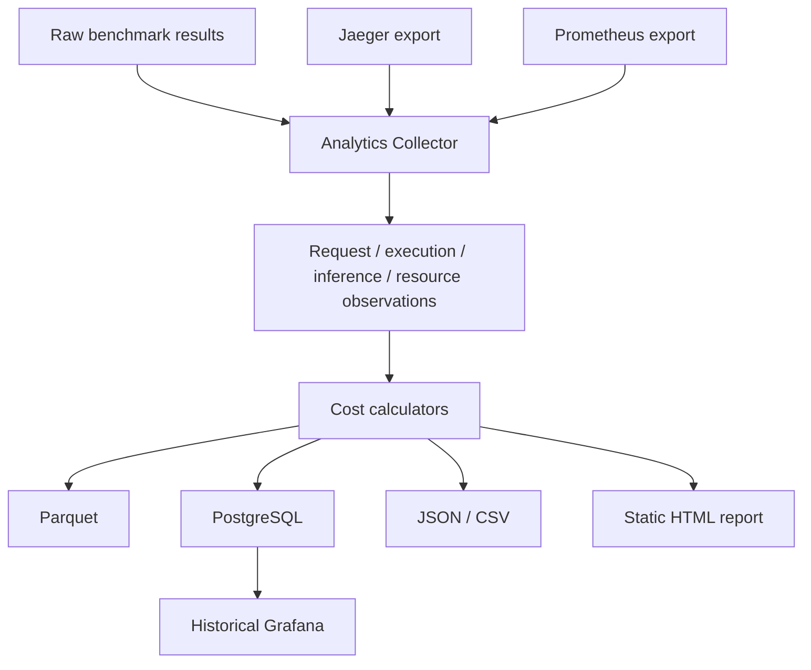

# Portfolio Systems Take-Home

## Submission Deliverables

**Recommended starting point:** the first two videos are silent recordings of the **same successful 100-query C2 run** (`NONCANONICAL_CPU_CANONICAL_100_C2-20260829T020534Z`). Video 1 captures the beginning/live execution; Video 2 captures the completed run and generated analytics. The matching frozen artifacts are committed directly in this repository.

### Videos

| Video | Link | Detailed description |
| --- | --- | --- |
| **1. Silent C2 Demo: Experiment Start + Live Execution** | https://www.loom.com/share/056bc8e3026a4d5e9b4a857cdd1d8a46 | **No audio.** Recorded at the beginning of the video-matched `canonical_100` experiment. Shows the C2 configuration (`concurrency=2`, noncanonical CPU mode, 300s request timeout), experiment launch, and the live system/observability view while the 100-query run is in progress. |
| **2. Silent C2 Demo: Completed Run + Analytics** | https://www.loom.com/share/96c09d837d554460b71b706ba0ea759b | **No audio.** Recorded after the same C2 experiment completed successfully. Shows the completed run, generated analytics/report, and post-run evidence for the exact run whose raw responses, telemetry, metrics, Parquet tables, and report are committed under `submission_artifacts/canonical_100_c2_recorded/`. |
| 3. Earlier Observability Walkthrough | https://www.loom.com/share/09aa634896924681a12b7d8f8015b522 | Supporting walkthrough of the experiment/observability workflow, including collected experiment data, Grafana, Jaeger, and benchmark/system views. Use Videos 1 and 2 above as the verified C2 run evidence. |
| 4. Analytics, Cost, and Metrics Walkthrough | https://www.loom.com/share/cfeac9f3be104d09a5ee32ab0db3d379 | Walkthrough of the generated analytics report, cost-attribution model, operational metric meaning, Jaeger request drilldown, and how the illustrative CPU cost model would be replaced with real GPU/provider cost inputs. |

### Evidence and Documentation

| Deliverable | Location | What it shows |
| --- | --- | --- |
| **Primary recorded 100-query C2 bundle** | [submission_artifacts/canonical_100_c2_recorded/](submission_artifacts/canonical_100_c2_recorded/) | Exact run shown in Videos 1 and 2: `canonical_100`, concurrency 2, **100/100 successful** |
| **Recorded-run static report** | [report/index.html](submission_artifacts/canonical_100_c2_recorded/analytics/report/index.html) | Frozen HTML/SVG analytics report for the video-matched run |
| **Recorded-run raw API responses** | [requests.jsonl](submission_artifacts/canonical_100_c2_recorded/raw/requests.jsonl) | Actual Gateway responses, including model-generated Advisor output |
| **Recorded-run derived metrics** | [metrics.json](submission_artifacts/canonical_100_c2_recorded/analytics/metrics.json) | Cost/query distribution, agent cost attribution, and derived run metrics |
| **Recorded-run serving telemetry** | [serving_telemetry.json](submission_artifacts/canonical_100_c2_recorded/analytics/serving_telemetry.json) | Inference latency, vLLM running/waiting requests, throughput, TTFT/TPOT, KV cache, and preemptions |
| **Additional verified 100-query C2 bundle** | [submission_artifacts/canonical_100_c2/](submission_artifacts/canonical_100_c2/) | Independent earlier `canonical_100`, concurrency 2 run with **100/100 successful**, retained as repeatability evidence |
| 10-query integration artifacts | [submission_artifacts/sampled_10/](submission_artifacts/sampled_10/) | 10/10 successful rehearsal of benchmark -> telemetry -> analytics -> report |
| Single-request validation | [submission_artifacts/single_request/](submission_artifacts/single_request/) | Fixed request/run/query IDs and live end-to-end validation scope |
| Successful experiment record | [docs/experiment_results.md](docs/experiment_results.md) | Canonical record of all successful submission experiments and their measurements |
| Architecture overview | [docs/architecture/overview.md](docs/architecture/overview.md) | Main request path and component boundaries |
| Metrics reference | [docs/metrics_reference.md](docs/metrics_reference.md) | What each metric measures, why it matters operationally, source, scope, and caveats |
| Cost methodology | [docs/cost_methodology.md](docs/cost_methodology.md) | Cost pools, token weighting, overhead, attribution, and assumptions |
| Tradeoffs and future work | [docs/tradeoffs_and_future_work.md](docs/tradeoffs_and_future_work.md) | Design choices, CPU/GPU limitations, timeout considerations, and next experiments |
| Demo diagrams | [docs/demo1_diagrams.md](docs/demo1_diagrams.md) | Mermaid diagrams used to explain the system and observability flow |
| Experiment scripts | [deploy/experiments/phase9_observability_demo.sh](deploy/experiments/phase9_observability_demo.sh) | Commands for single-request, 10-query, and verified 100-query CPU runs |

**Fast reviewer path:** Videos 1 and 2 -> matching recorded C2 report/raw responses -> experiment results -> metrics/cost methodology -> architecture and tradeoffs.

This repository turns the supplied multi-agent portfolio workflow into a
reviewable serving and benchmarking system. It adds a Gateway, Portfolio API,
OpenAI-compatible Advisor inference through vLLM/Qwen, live observability,
post-run telemetry export, historical analytics, cost attribution, Parquet and
PostgreSQL persistence, and a generated static HTML/SVG report.

Two environments are intentionally distinct:

| Path | Model / Hardware | Purpose |
| --- | --- | --- |
| CPU demo | `Qwen/Qwen3-0.6B` on local CPU | Noncanonical integration rehearsal, observability demo, and artifact validation |
| Canonical GPU target | `Qwen/Qwen3-4B-Instruct-2507` on single-GPU vLLM BF16 | Intended assignment benchmark path with real provider cost and DCGM GPU telemetry |

The committed CPU artifacts demonstrate that the complete system works end to
end. They are not GPU performance claims.

## What Was Implemented

- Gateway validation, correlation headers, bounded admission, and queueing.
- Portfolio API wrapping the supplied workflow without changing the business response shape.
- PriceAgent, MetricsAgent fan-out, RiskAgent, AdvisorAgent, and one Advisor inference call per successful workflow.
- OpenAI-compatible inference client and vLLM serving path.
- Request correlation using `run_id`, `request_id`, and `query_id`.
- Prometheus metrics, OpenTelemetry traces, Jaeger, structured JSON logs, Alloy/Loki, and Grafana dashboards.
- Async benchmark runner with deterministic query normalization.
- Post-run Jaeger/Prometheus telemetry freeze/export.
- Analytics collector producing normalized request, execution, inference, and resource observations.
- Versioned cost profiles and recalculable cost metrics.
- Parquet and PostgreSQL historical persistence.
- Generated JSON/CSV analytics and static HTML/SVG report.

## Architecture



`run_id` identifies one experiment, `request_id` identifies one execution, and
`query_id` links that execution back to the benchmark input. These IDs appear in
traces, logs, raw benchmark observations, PostgreSQL, and Parquet. They are not
Prometheus labels because per-request labels create high-cardinality time
series; Prometheus is kept for low-cardinality aggregates.

## Observability



- Grafana: live aggregate serving behavior and historical dashboards.
- Prometheus: low-cardinality time-series metrics.
- Jaeger: one-request execution hierarchy and inference spans.
- Loki: structured logs correlated by request and trace fields.

## Benchmark To Historical Analytics



Mental model: raw data is what happened, telemetry is how it executed, and analytics is what we concluded.

## Successful Experiments

See [docs/experiment_results.md](docs/experiment_results.md) for the canonical record.

| Run | Dataset | Concurrency | Result | Committed evidence |
| --- | --- | --- | --- | --- |
| `NONCANONICAL_CPU_CANONICAL_100_C2-20260829T020534Z` | `canonical_100` | 2 | **100/100 successful** | [canonical_100_c2_recorded](submission_artifacts/canonical_100_c2_recorded/) - exact run shown in Videos 1 and 2 |
| `NONCANONICAL_CPU_CANONICAL_100_C2-20260828T213917Z` | `canonical_100` | 2 | **100/100 successful** | [canonical_100_c2](submission_artifacts/canonical_100_c2/) - independent earlier successful run |
| `NONCANONICAL_CPU_INTEGRATION-20260828T205107Z` | `sampled_10`, seed 81 | 2 | 10/10 successful | [sampled_10](submission_artifacts/sampled_10/) |
| `NONCANONICAL_CPU_INTEGRATION_SINGLE` | one request | 1 | completed manually | [single_request](submission_artifacts/single_request/) |

Two independent C2 100-query CPU runs are committed and both completed 100/100.
The newer recorded run is the primary reviewer evidence because it matches the
silent C2 videos exactly; the earlier C2 bundle is retained as independent
repeatability evidence. The local CPU environment is for integration and
observability, not capacity characterization.

## Cost Attribution

The CPU demo uses [configs/cost/reference_cpu_demo.yaml](configs/cost/reference_cpu_demo.yaml):

- `machine_hourly_usd = 1.00`
- `cpu_pool_fraction = 0.35`
- `gpu_pool_fraction = 0.45`
- `overhead_pool_fraction = 0.20`
- `prefill_token_weight = 1`
- `decode_token_weight = 4`

These are configurable accounting assumptions for the CPU demo, not measured physical hardware fractions.

```text
total infrastructure cost = measured run duration hours * machine hourly price
token_work = prompt_tokens * prefill_weight + completion_tokens * decode_weight
```

CPU-side allocation covers PriceAgent, MetricsAgent, and RiskAgent using measured CPU time when present. The CPU rehearsal can fall back to exclusive nested-span wall time; child span work is subtracted from parent work to avoid double counting. The inference pool is attributed to AdvisorAgent at the agent level and divided across requests by weighted token work. Request-level overhead uses request wall-time weighting, while agent-level overhead remains explicit as `overhead_unallocated`.

More detail: [docs/cost_methodology.md](docs/cost_methodology.md) and [portfolio/portfolio/analytics/calculators/cost.py](portfolio/portfolio/analytics/calculators/cost.py).

## How To Run

```bash
deploy/experiments/phase9_observability_demo.sh up
deploy/experiments/phase9_observability_demo.sh health
deploy/experiments/phase9_observability_demo.sh urls
deploy/experiments/phase9_observability_demo.sh single_request
deploy/experiments/phase9_observability_demo.sh small_benchmark
deploy/experiments/phase9_observability_demo.sh run_100 2
```

The run script executes benchmark traffic, exports telemetry, builds analytics,
calculates costs, writes Parquet/PostgreSQL artifacts, renders the static report,
verifies expected files, and prints the resulting `RUN_ID` and report path.

The recorded C2 run used a 300-second request timeout because local CPU inference
is substantially slower than the intended GPU deployment. The request timeout is
an execution budget, not a performance target.

### Local CPU Hardware And Timeout Scope

The CPU path is intentionally conservative. CPU inference is much slower than
the target GPU deployment, and one request crosses multiple bounded layers:
benchmark client -> Gateway downstream request -> Portfolio inference -> vLLM.
Those timeout budgets must be calibrated together when testing higher offered
load. The verified submission results therefore use concurrency 2, where the
100-query workload completes cleanly. Capacity and saturation testing belongs on
the canonical GPU path with production-like timeout and admission settings.

## Committed Submission Evidence

The repository includes frozen evidence for every successful submission run
under [`submission_artifacts/`](submission_artifacts/). The primary reviewer
bundle, matching Videos 1 and 2, is:

```text
submission_artifacts/canonical_100_c2_recorded/
├── README.md
├── raw/
│   ├── requests.jsonl
│   ├── resolved_benchmark_config.yaml
│   └── run.json
├── telemetry/
│   ├── *_jaeger_traces.json
│   └── *_prometheus_samples.json
└── analytics/
    ├── metrics.json
    ├── report.json
    ├── provenance.json
    ├── serving_telemetry.json
    ├── summary.csv
    ├── *.parquet
    ├── charts/
    └── report/index.html
```

An independent earlier successful C2 snapshot is retained at
[`submission_artifacts/canonical_100_c2/`](submission_artifacts/canonical_100_c2/).
These committed files let a reviewer inspect both successful 100-query runs
without rerunning the local stack. New experiments continue to write their
working artifacts under the ignored local `results/phase8/` tree.

## Viewing Actual Generated Advice

The raw response file for the exact run shown in Videos 1 and 2 is:

[`submission_artifacts/canonical_100_c2_recorded/raw/requests.jsonl`](submission_artifacts/canonical_100_c2_recorded/raw/requests.jsonl)

For example:

```python
import json
from pathlib import Path

path = Path("submission_artifacts/canonical_100_c2_recorded/raw/requests.jsonl")

for line in path.read_text().splitlines():
    row = json.loads(line)
    if row.get("success"):
        print(json.dumps(row["response_body"], indent=2))
        break
```

## Live Interfaces

When the local stack is running:

- Grafana: `http://localhost:3000`
- Jaeger: `http://localhost:16686`
- Prometheus: `http://localhost:9090`

Jaeger tag query:

```json
{"run_id":"<RUN_ID>"}
```

Useful `inference.request` fields include model, prompt tokens, completion tokens, total tokens, request ID, query ID, run ID, and retry count.

## Key Findings

For the video-matched 100-query CPU run `NONCANONICAL_CPU_CANONICAL_100_C2-20260829T020534Z`:

- 100 requests attempted, **100 successful, 0 failures**.
- Total illustrative CPU-demo cost: `$0.375744`.
- Mean cost/query: `$0.003757`.
- Median cost/query: `$0.003052`.
- p95 cost/query: `$0.006657`.
- p99 cost/query: `$0.016569`.
- Inference span latency: p50 about `26.40 s`, p95 about `40.53 s`.
- vLLM running requests maxed at `2`, matching client concurrency.
- vLLM waiting requests stayed at `0`.
- vLLM preemptions stayed at `0`.
- Maximum observed generation throughput was about `12.59 tokens/s`.
- The report and traces show Advisor/inference latency dominates this CPU demo.

The earlier committed C2 run independently completed 100/100 as well. These are
CPU integration findings and reproducibility evidence, not production GPU
performance claims.

## CPU Demo Vs Canonical GPU

| Dimension | CPU demo | Canonical GPU target |
| --- | --- | --- |
| Model | `Qwen/Qwen3-0.6B` | `Qwen/Qwen3-4B-Instruct-2507` |
| Hardware | local CPU / WSL-friendly rehearsal | single GPU |
| vLLM dtype | BF16 config path where supported | BF16 |
| Cost | synthetic illustrative profile | real provider instance cost |
| GPU telemetry | expected N/A locally | DCGM utilization, VRAM, power, temp, energy |
| Purpose | integration and demo validation | canonical benchmark environment |

## Documentation Guide

- [docs/experiment_results.md](docs/experiment_results.md)
- [docs/metrics_reference.md](docs/metrics_reference.md)
- [docs/tradeoffs_and_future_work.md](docs/tradeoffs_and_future_work.md)
- [docs/cost_methodology.md](docs/cost_methodology.md)
- [docs/experiment_guide.md](docs/experiment_guide.md)
- [docs/data_locations.md](docs/data_locations.md)
- [docs/demo_walkthrough.md](docs/demo_walkthrough.md)
- [docs/demo1_diagrams.md](docs/demo1_diagrams.md)
- [docs/architecture/overview.md](docs/architecture/overview.md)
- [docs/architecture/system_contracts.md](docs/architecture/system_contracts.md)
- [docs/architecture/observability_data_flow.md](docs/architecture/observability_data_flow.md)
- [docs/architecture/analytics_data_flow.md](docs/architecture/analytics_data_flow.md)
