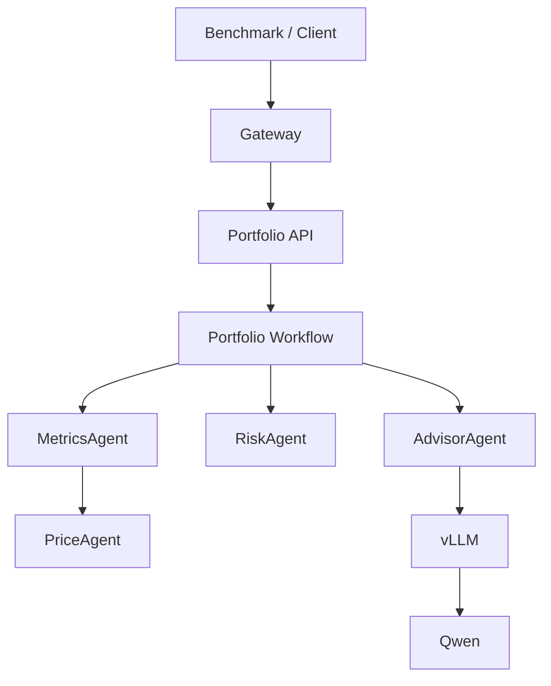
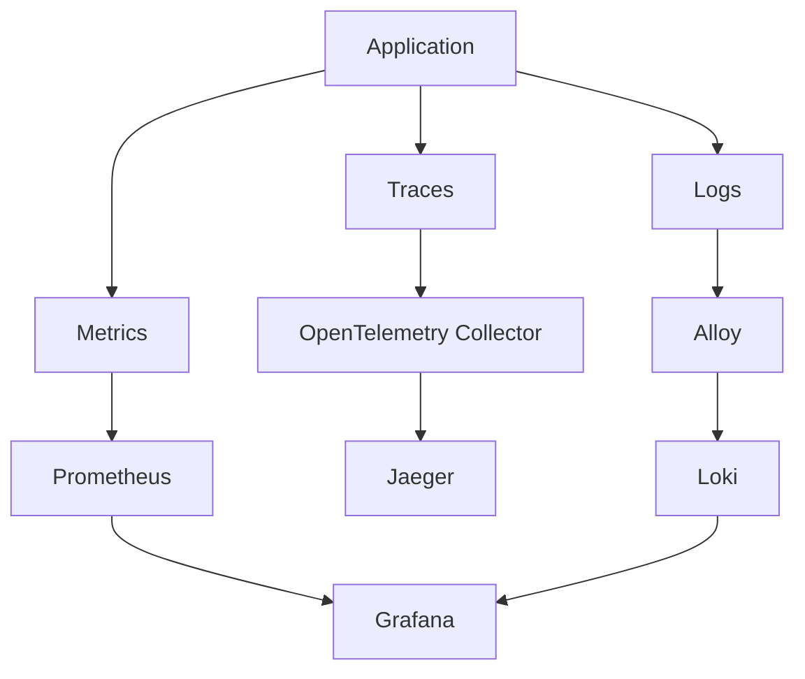
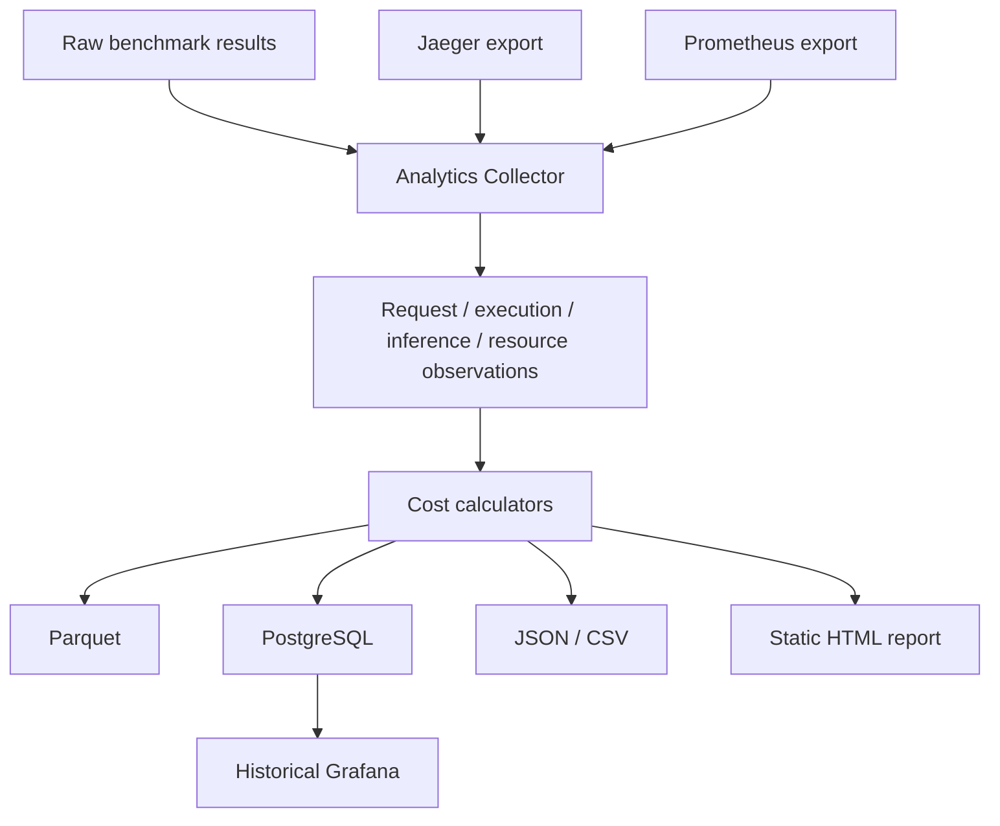

# Portfolio Systems Take-Home

This repository turns the supplied multi-agent portfolio workflow into a
reviewable serving and benchmarking system. It adds a Gateway, Portfolio API,
OpenAI-compatible Advisor inference through vLLM/Qwen, live observability,
post-run telemetry export, historical analytics, cost attribution, Parquet and
PostgreSQL persistence, and a generated static HTML/SVG report.

Two environments are intentionally distinct:

| Path | Model / Hardware | Purpose |
| --- | --- | --- |
| CPU demo | `Qwen/Qwen3-0.6B` on local CPU | Noncanonical integration rehearsal, observability demo, and artifact validation |
| Canonical GPU target | `Qwen/Qwen3-4B-Instruct-2507` on single-GPU vLLM BF16 | Intended assignment benchmark path with real provider cost and DCGM GPU telemetry |

The CPU results below are useful evidence that the full system works end to
end. They are not GPU performance claims.

## Submission Deliverables

| Deliverable | Location | What it shows |
| --- | --- | --- |
| Loom 1 | https://www.loom.com/share/09aa634896924681a12b7d8f8015b522 | Successful experiment run, collected data, live observability, Grafana, Jaeger, and benchmark output |
| Loom 2 | https://www.loom.com/share/cfeac9f3be104d09a5ee32ab0db3d379 | Generated analytics report, cost model, metric meaning, Jaeger drilldown, and replacing CPU demo cost with real GPU cost |
| Architecture overview | [docs/architecture/overview.md](docs/architecture/overview.md) | Main request path and component boundaries |
| Successful experiments | [docs/experiment_results.md](docs/experiment_results.md) | Verified single-request, 10-query, and 100-query CPU evidence |
| Metrics reference | [docs/metrics_reference.md](docs/metrics_reference.md) | What each metric means, why it matters operationally, where it comes from, and where it is stored |
| Cost methodology | [docs/cost_methodology.md](docs/cost_methodology.md) | Cost pools, token weighting, overhead, and attribution rules |
| Tradeoffs and future work | [docs/tradeoffs_and_future_work.md](docs/tradeoffs_and_future_work.md) | Design choices, hardware/timeout limitations, and realistic next experiments |
| Demo diagrams | [docs/demo1_diagrams.md](docs/demo1_diagrams.md) | GitHub Mermaid diagrams used in the recorded demos |
| Experiment scripts | [deploy/experiments/phase9_observability_demo.sh](deploy/experiments/phase9_observability_demo.sh) | CPU demo commands for single request, 10-query, and verified 100-query baseline |
| Raw API responses | `results/phase8/raw/<RUN_ID>/requests.jsonl` | Actual Gateway responses, including generated Advisor output |
| Telemetry artifacts | `results/phase8/telemetry/<RUN_ID>/` | Frozen Jaeger and Prometheus exports |
| Analytics artifacts | `results/phase8/analytics/<RUN_ID>/` | Parquet, JSON, CSV, chart data, and generated report |
| Static HTML report | `results/phase8/analytics/<RUN_ID>/report/index.html` | Reviewer-facing frozen report for one run |
| Grafana | `http://localhost:3000` | Live dashboards and historical PostgreSQL dashboard |
| Jaeger | `http://localhost:16686` | Individual request trace drilldown |

## What Was Implemented

- Gateway validation, correlation headers, bounded admission, and queueing.
- Portfolio API wrapping the supplied workflow without changing the business response shape.
- PriceAgent, MetricsAgent fan-out, RiskAgent, AdvisorAgent, and one Advisor inference call per successful workflow.
- OpenAI-compatible inference client and vLLM serving path.
- Request correlation using `run_id`, `request_id`, and `query_id`.
- Prometheus metrics, OpenTelemetry traces, Jaeger, structured JSON logs, Alloy/Loki, and Grafana dashboards.
- Async benchmark runner with deterministic query normalization.
- Post-run Jaeger/Prometheus telemetry freeze/export.
- Analytics collector producing normalized request, execution, inference, and resource observations.
- Versioned cost profiles and recalculable cost metrics.
- Parquet and PostgreSQL historical persistence.
- Generated JSON/CSV analytics and static HTML/SVG report.

## Architecture



`run_id` identifies one experiment, `request_id` identifies one execution, and
`query_id` links that execution back to the benchmark input. These IDs appear in
traces, logs, raw benchmark observations, PostgreSQL, and Parquet. They are not
Prometheus labels because per-request labels create high-cardinality time
series; Prometheus is kept for low-cardinality aggregates.

## Observability



- Grafana: live aggregate serving behavior and historical dashboards.
- Prometheus: low-cardinality time-series metrics.
- Jaeger: one-request execution hierarchy and inference spans.
- Loki: structured logs correlated by request and trace fields.

## Benchmark To Historical Analytics



Mental model: raw data is what happened, telemetry is how it executed, and analytics is what we concluded.

## Successful Experiments

See [docs/experiment_results.md](docs/experiment_results.md) for the canonical record.

| Run | Dataset | Concurrency | Result | Purpose |
| --- | --- | --- | --- | --- |
| `NONCANONICAL_CPU_INTEGRATION_SINGLE` | one request | 1 | completed manually | Workflow, trace propagation, and generated Advisor response validation |
| `NONCANONICAL_CPU_INTEGRATION-20260828T205107Z` | `sampled_10`, seed 81 | 2 | 10/10 successful | Full benchmark -> telemetry -> analytics -> report rehearsal |
| `NONCANONICAL_CPU_CANONICAL_100_C2-20260828T213917Z` | `canonical_100` | 2 | 100/100 successful | Required 100-query CPU baseline evidence |

The submission intentionally uses the verified C2 100-query run as the CPU
baseline. The local CPU environment is for integration and observability, not
capacity characterization.

## Cost Attribution

The CPU demo uses [configs/cost/reference_cpu_demo.yaml](configs/cost/reference_cpu_demo.yaml):

- `machine_hourly_usd = 1.00`
- `cpu_pool_fraction = 0.35`
- `gpu_pool_fraction = 0.45`
- `overhead_pool_fraction = 0.20`
- `prefill_token_weight = 1`
- `decode_token_weight = 4`

These are configurable accounting assumptions for the CPU demo, not measured physical hardware fractions.

```text
total infrastructure cost = measured run duration hours * machine hourly price
token_work = prompt_tokens * prefill_weight + completion_tokens * decode_weight
```

CPU-side allocation covers PriceAgent, MetricsAgent, and RiskAgent using measured CPU time when present. The CPU rehearsal can fall back to exclusive nested-span wall time; child span work is subtracted from parent work to avoid double counting. The inference pool is attributed to AdvisorAgent at the agent level and divided across requests by weighted token work. Request-level overhead uses request wall-time weighting, while agent-level overhead remains explicit as `overhead_unallocated`.

More detail: [docs/cost_methodology.md](docs/cost_methodology.md) and [portfolio/portfolio/analytics/calculators/cost.py](portfolio/portfolio/analytics/calculators/cost.py).

## How To Run

```bash
deploy/experiments/phase9_observability_demo.sh up
deploy/experiments/phase9_observability_demo.sh health
deploy/experiments/phase9_observability_demo.sh urls
deploy/experiments/phase9_observability_demo.sh single_request
deploy/experiments/phase9_observability_demo.sh small_benchmark
deploy/experiments/phase9_observability_demo.sh run_100 2
```

The run script executes benchmark traffic, exports telemetry, builds analytics,
calculates costs, writes Parquet/PostgreSQL artifacts, renders the static report,
verifies expected files, and prints the resulting `RUN_ID` and report path.

### Local CPU Hardware And Timeout Scope

The CPU path is intentionally conservative. CPU inference is much slower than
the target GPU deployment, and one request crosses multiple bounded layers:
benchmark client -> Gateway downstream request -> Portfolio inference -> vLLM.
Those timeout budgets must be calibrated together when testing higher offered
load. The verified submission result therefore uses concurrency 2, where the
100-query workload completes cleanly. Capacity and saturation testing belongs on
the canonical GPU path with production-like timeout and admission settings.

## Where Results Live

```text
results/phase8/raw/<RUN_ID>/
results/phase8/telemetry/<RUN_ID>/
results/phase8/analytics/<RUN_ID>/
```

Important files:

- Raw: `run.json`, `requests.jsonl`, resolved benchmark configuration.
- Telemetry: frozen Jaeger traces and Prometheus samples.
- Analytics: `run.json`, `provenance.json`, `metrics.json`, `report.json`, `summary.csv`, `serving_telemetry.json`, Parquet tables, `charts/`, `report/index.html`, and `report/assets/`.

`requests.jsonl` contains actual API responses, including generated Advisor output. `metrics.json` contains derived metrics. Parquet contains detailed machine-readable historical analytics. `report/index.html` is the portable reviewer-facing report.

## Viewing Actual Generated Advice

```python
import json
from pathlib import Path

run_id = "NONCANONICAL_CPU_CANONICAL_100_C2-20260828T213917Z"
path = Path("results/phase8/raw") / run_id / "requests.jsonl"

for line in path.read_text().splitlines():
    row = json.loads(line)
    if row.get("success"):
        print(json.dumps(row["response_body"], indent=2))
        break
```

## Live Interfaces

- Grafana: `http://localhost:3000`
- Jaeger: `http://localhost:16686`
- Prometheus: `http://localhost:9090`

Jaeger tag query:

```json
{"run_id":"<RUN_ID>"}
```

Useful `inference.request` fields include model, prompt tokens, completion tokens, total tokens, request ID, query ID, run ID, and retry count.

## Key Findings

For the verified 100-query CPU run `NONCANONICAL_CPU_CANONICAL_100_C2-20260828T213917Z`:

- 100 requests attempted, 100 successful, 0 failures.
- Total illustrative CPU-demo cost: `$0.355583`.
- Mean cost/query: `$0.003556`.
- p95 cost/query: `$0.006664`.
- vLLM running requests maxed at 2, matching client concurrency.
- vLLM waiting requests stayed at 0.
- vLLM preemptions stayed at 0.
- The report and traces show Advisor/inference latency dominates this CPU demo.

These are CPU integration findings, not production GPU performance claims.

## CPU Demo Vs Canonical GPU

| Dimension | CPU demo | Canonical GPU target |
| --- | --- | --- |
| Model | `Qwen/Qwen3-0.6B` | `Qwen/Qwen3-4B-Instruct-2507` |
| Hardware | local CPU / WSL-friendly rehearsal | single GPU |
| vLLM dtype | BF16 config path where supported | BF16 |
| Cost | synthetic illustrative profile | real provider instance cost |
| GPU telemetry | expected N/A locally | DCGM utilization, VRAM, power, temp, energy |
| Purpose | integration and demo validation | canonical benchmark environment |

## Documentation Guide

- [docs/experiment_results.md](docs/experiment_results.md)
- [docs/metrics_reference.md](docs/metrics_reference.md)
- [docs/tradeoffs_and_future_work.md](docs/tradeoffs_and_future_work.md)
- [docs/cost_methodology.md](docs/cost_methodology.md)
- [docs/experiment_guide.md](docs/experiment_guide.md)
- [docs/data_locations.md](docs/data_locations.md)
- [docs/demo_walkthrough.md](docs/demo_walkthrough.md)
- [docs/demo1_diagrams.md](docs/demo1_diagrams.md)
- [docs/architecture/overview.md](docs/architecture/overview.md)
- [docs/architecture/system_contracts.md](docs/architecture/system_contracts.md)
- [docs/architecture/observability_data_flow.md](docs/architecture/observability_data_flow.md)
- [docs/architecture/analytics_data_flow.md](docs/architecture/analytics_data_flow.md)
