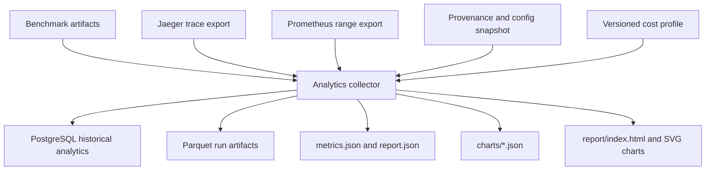
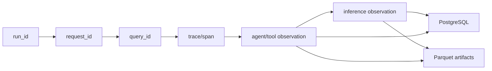
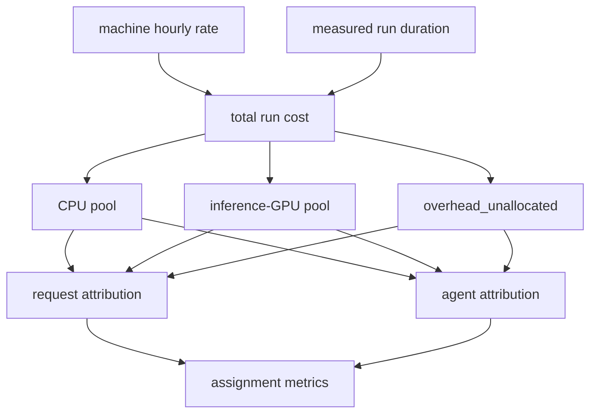

# Analytics Data Flow

Raw observations are persisted first:

- `requests.parquet`
- `execution_observations.parquet`
- `inference_observations.parquet`
- `resource_samples.parquet`

Derived outputs are recalculable:

- `request_cost_attributions.parquet`
- `agent_cost_attributions.parquet`
- `metrics.json`
- `report.json`
- `charts/*.json`
- `serving_telemetry.json`
- `report/index.html`

Historical reproducibility does not depend on Jaeger retaining traces forever;
the exported trace content is normalized into execution and inference
observations and preserved in raw artifact fields.

## Drilldown And Identity Flow

The same identity values are present in traces, logs, benchmark observations,
PostgreSQL rows, and Parquet files. They are intentionally absent from
Prometheus labels.

## Cost Attribution Flow

The `overhead_unallocated` pool remains explicit so attributed request costs
sum back to the run cost without pretending all shared infrastructure time came
from one agent.
