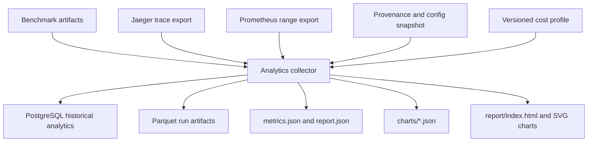

# Analytics Data Flow

Raw observations are persisted first:

- `requests.parquet`
- `execution_observations.parquet`
- `inference_observations.parquet`
- `resource_samples.parquet`

Derived outputs are recalculable:

- `request_cost_attributions.parquet`
- `agent_cost_attributions.parquet`
- `metrics.json`
- `report.json`
- `charts/*.json`
- `serving_telemetry.json`
- `report/index.html`

Historical reproducibility does not depend on Jaeger retaining traces forever;
the exported trace content is normalized into execution and inference
observations and preserved in raw artifact fields.
