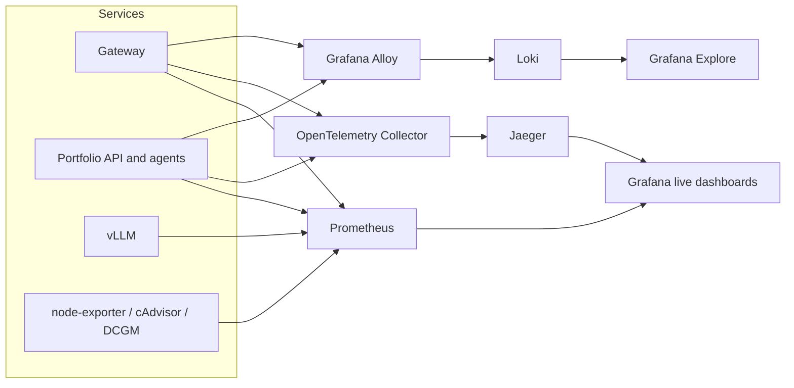

# Observability Data Flow

Prometheus labels stay low-cardinality. Request identity belongs in trace
attributes, structured JSON log fields, benchmark artifacts, PostgreSQL, and
Parquet.

Use these live views:

- Grafana `System Overview`: service health and high-level load.
- Grafana `Gateway`: admission, queueing, rejections, downstream latency.
- Grafana `Agent / Workflow Breakdown`: agent/tool volume and latency.
- Grafana `vLLM Inference`: scheduler, token, queue, KV-cache, and inference metrics.
- Grafana `Resources`: host/container/GPU resource telemetry.
- Grafana `Live Benchmark`: live traffic during an experiment.
- Jaeger: exact request trace hierarchy.
- Grafana Explore with Loki: correlated JSON logs.
