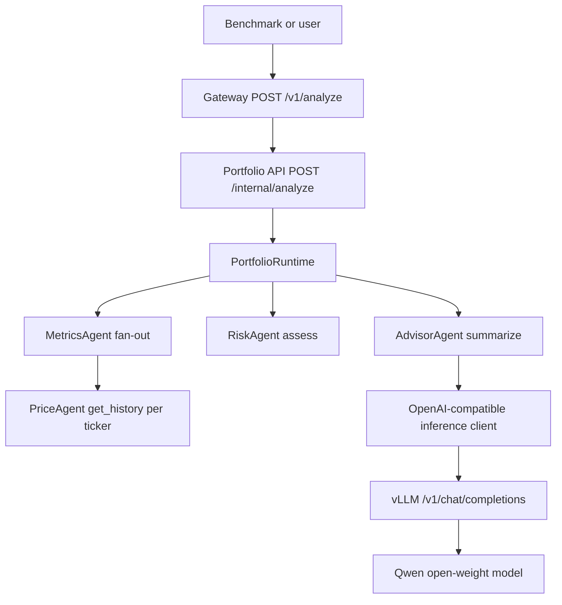

# Architecture Overview

The workload preserves the supplied portfolio execution order.

Request identity is carried as `run_id`, `request_id`, and `query_id` through
headers, spans, logs, benchmark observations, Parquet, and PostgreSQL. These IDs
are not Prometheus labels.

Live and historical data serve different jobs:

- Prometheus and Grafana show low-cardinality live aggregate behavior.
- Jaeger shows request traces while trace retention lasts.
- Loki stores structured application/container logs.
- PostgreSQL stores queryable historical experiment observations.
- Parquet/JSON artifacts make each run portable and reproducible.
- The generated HTML report is a frozen reviewer-facing presentation for one run.

See [observability data flow](observability_data_flow.md) and
[analytics data flow](analytics_data_flow.md) for the exact paths.
