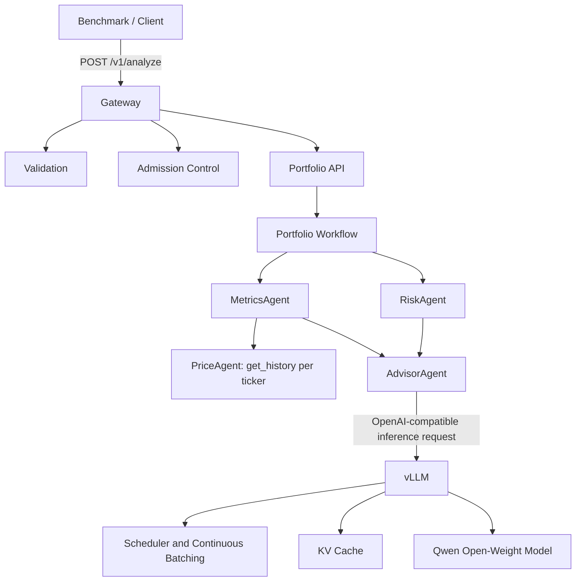
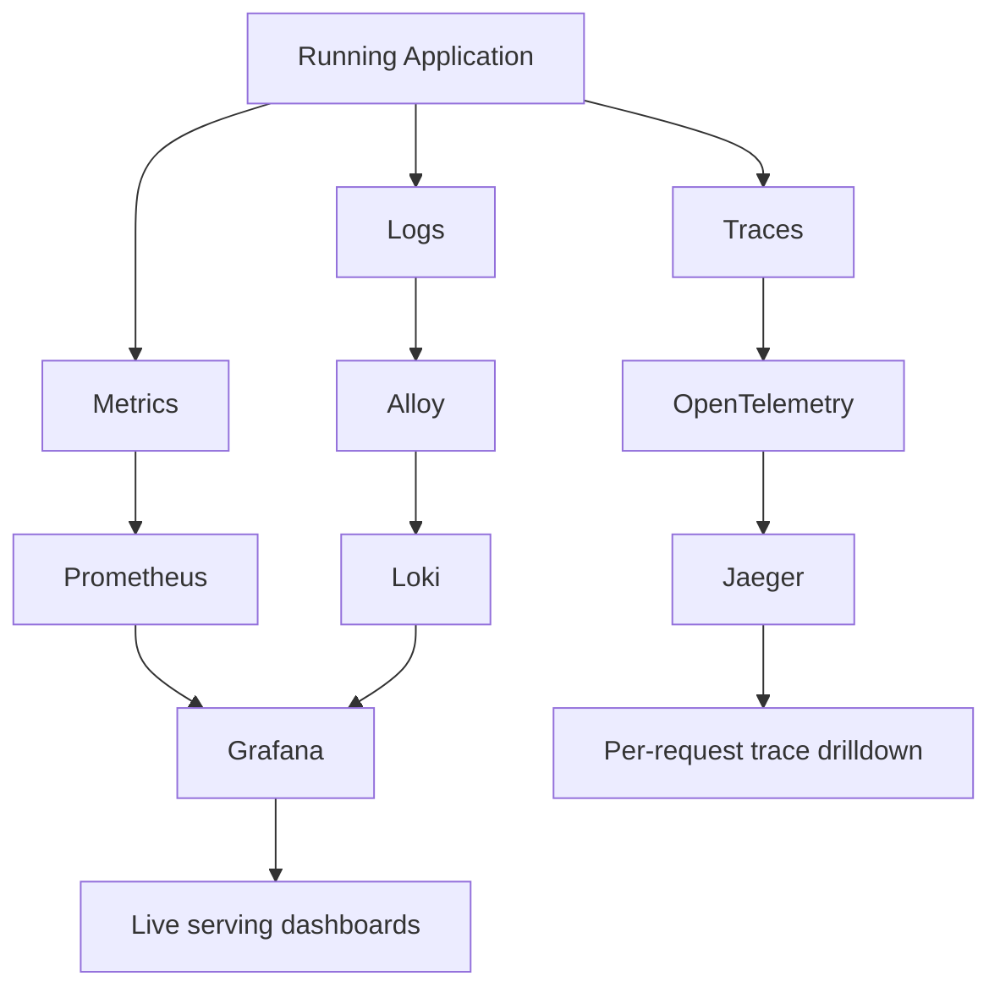
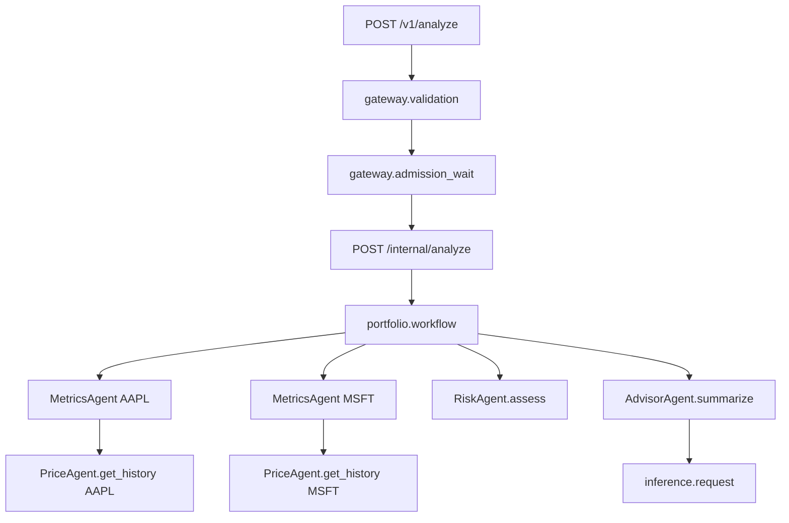
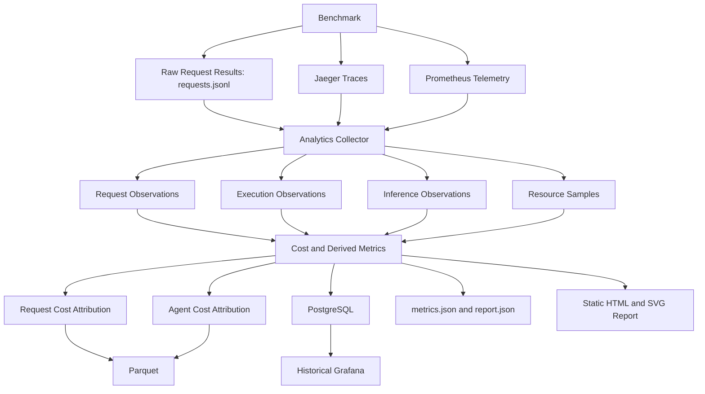
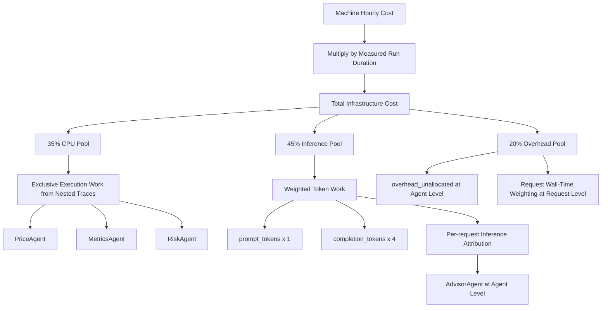
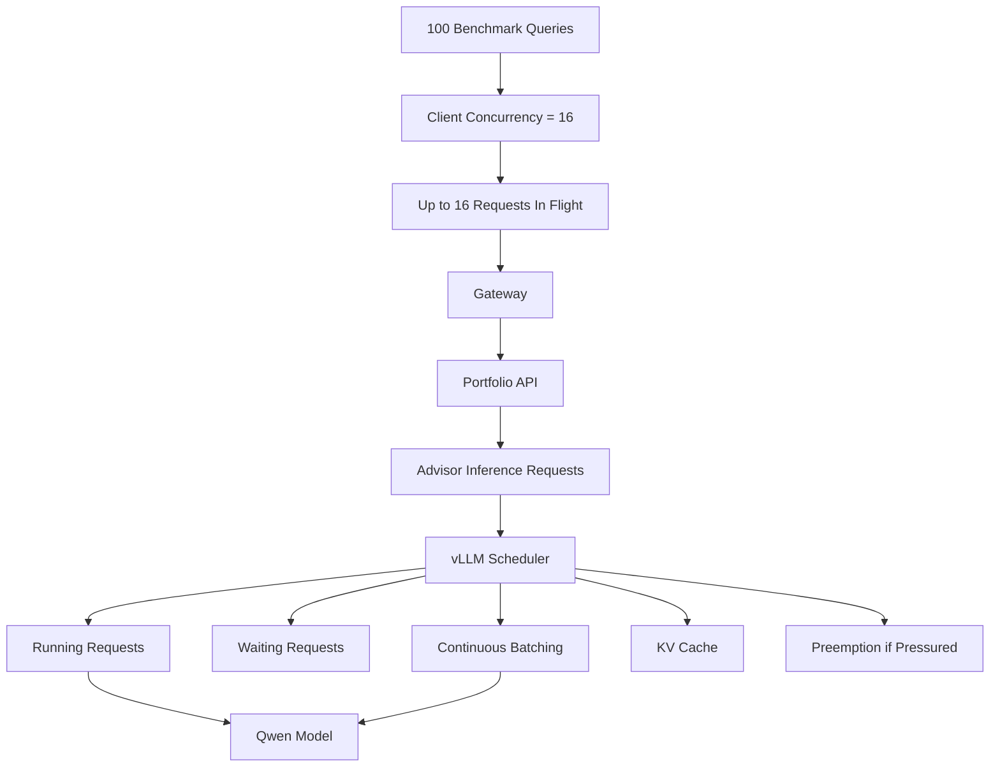

# Demo 1 Diagrams: 100-Query C=16 Observability Walkthrough

Use this file as the visual reference during Loom Demo 1.

## Diagram 1: End-to-End Request Architecture



Key points:
- Gateway is the public request boundary.
- Portfolio API executes the supplied multi-agent workflow.
- MetricsAgent fans out to PriceAgent for holdings.
- RiskAgent computes portfolio risk.
- AdvisorAgent performs the LLM-backed summarization step.
- vLLM is the model-serving layer for scheduling, batching, KV cache, and inference execution.

## Diagram 2: Live Observability Flow



Key points:
- Prometheus answers: what is the whole system doing?
- Jaeger answers: what happened to this specific request?
- Loki stores structured logs.
- Grafana is the primary live operational view.

## Diagram 3: One Request in Jaeger



Correlation IDs:
- `run_id`
- `request_id`
- `query_id`

Useful fields on `inference.request`:
- model
- prompt tokens
- completion tokens
- total tokens
- retry count
- request ID
- query ID
- run ID

## Diagram 4: Benchmark to Historical Analytics



Mental model:
- Raw data = what happened.
- Telemetry = how it executed.
- Analytics = what we concluded.

## Diagram 5: Cost Attribution Model



Important caveat:
- The CPU rehearsal uses an illustrative synthetic cost profile.
- `35% / 45% / 20%` are configured accounting assumptions.
- `1 / 4` token weights are configurable heuristics.
- They are not claims about exact physical hardware cost.

## Diagram 6: Concurrency and vLLM Serving



Metrics to watch:
- Requests running
- Requests waiting
- Prompt throughput
- Generation throughput
- TTFT
- TPOT
- Queue latency
- KV-cache utilization
- Preemptions
- Success rate
- p95 latency

## Quick Demo Commands

Run the 100-query C=16 experiment:

```bash
deploy/experiments/phase9_observability_demo.sh run_100 16
```

Grafana:

```text
http://localhost:3000
```

Jaeger:

```text
http://localhost:16686
```

After the script prints the run ID, search Jaeger with:

```json
{"run_id":"<RUN_ID>"}
```

Generated report:

```text
results/phase8/analytics/<RUN_ID>/report/index.html
```
