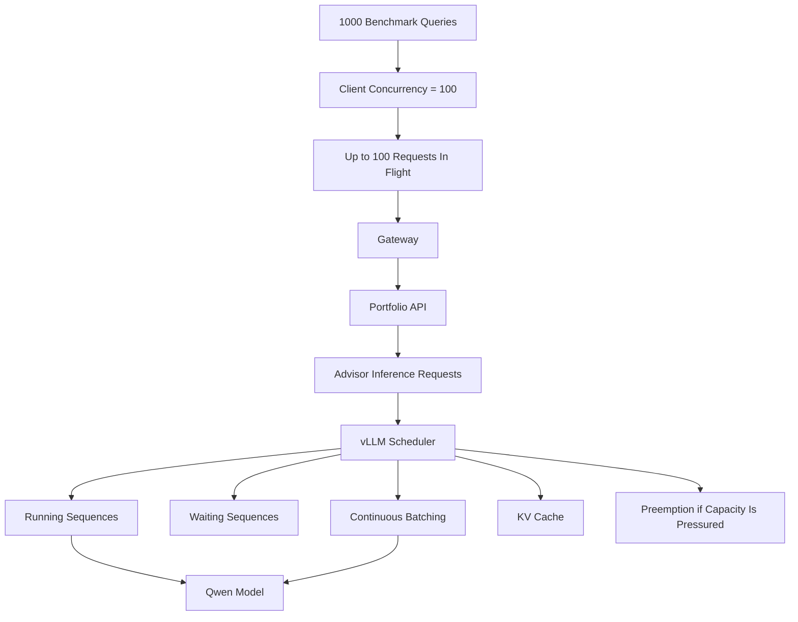
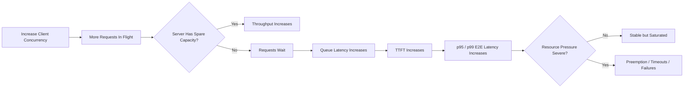
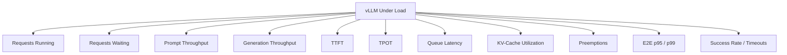
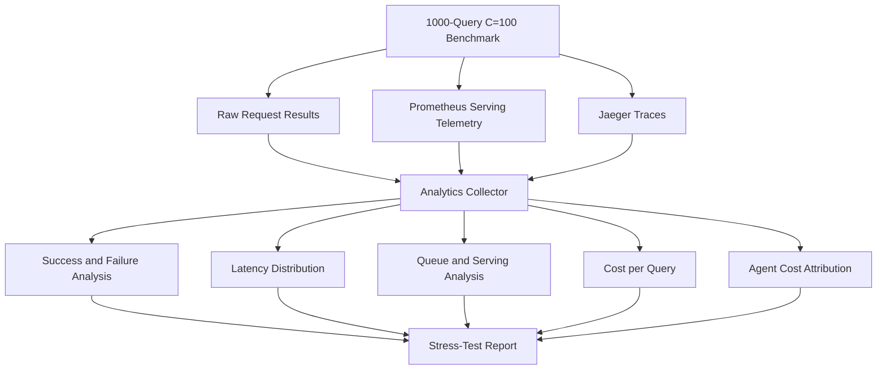

# Demo 2 Diagrams: 1000-Query C=100 Stress Test

Use this file as the visual reference for the later high-concurrency stress-test Loom.

## Diagram 1: Stress-Test Request Pressure



Key point:
- Client concurrency is intentionally much higher than the normal demo workload so the test can reveal queueing, saturation, tail-latency growth, and failure behavior.

## Diagram 2: What Saturation Looks Like



## Diagram 3: vLLM Signals to Watch



Interpretation:
- Throughput rising with low waiting means useful parallelism remains.
- Waiting and queue latency rising indicate scheduler pressure.
- TTFT usually reflects queueing plus prefill pressure.
- TPOT reflects decode efficiency under load.
- High KV-cache usage and preemptions indicate memory pressure.
- Tail latency and failure rate determine whether the system remains usable.

## Diagram 4: Stress-Test Analysis Flow



## Demo 2 Questions to Answer

1. How many requests can the system keep actively running?
2. When do requests begin waiting?
3. Does throughput continue improving at C=100?
4. How much do TTFT and p95/p99 latency increase?
5. Does KV-cache utilization become significant?
6. Are there preemptions?
7. Do requests time out or fail?
8. Is the bottleneck Gateway admission, workflow execution, or inference serving?

## Stress-Test Command

Once the 1000-query runner is finalized, the intended interface is:

```bash
deploy/experiments/phase9_observability_demo.sh run_1000 100
```

The resulting report follows the same run-scoped structure:

```text
results/phase8/analytics/<RUN_ID>/report/index.html
```
